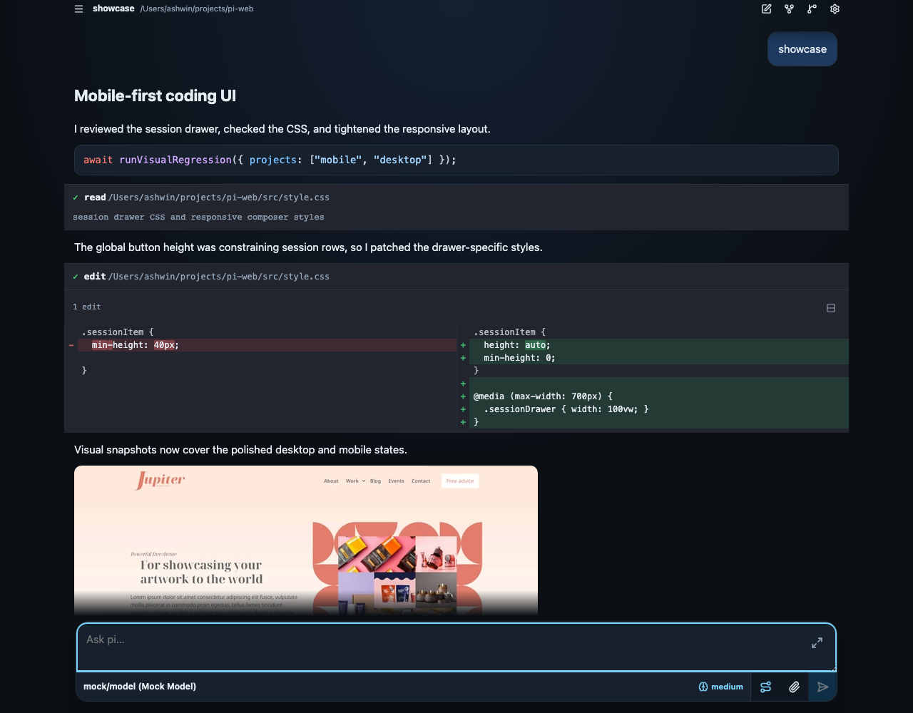
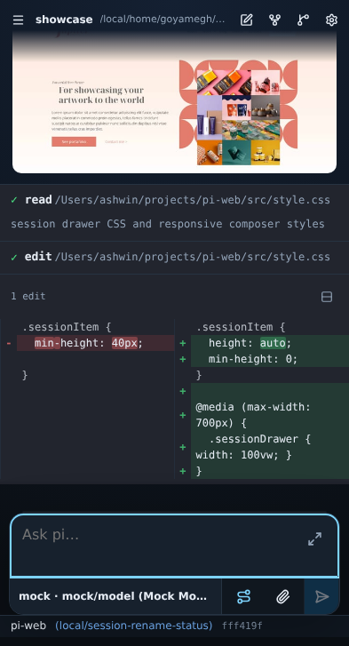
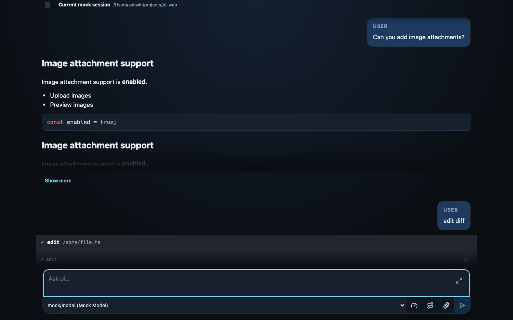
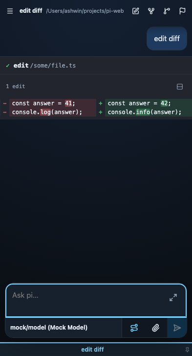
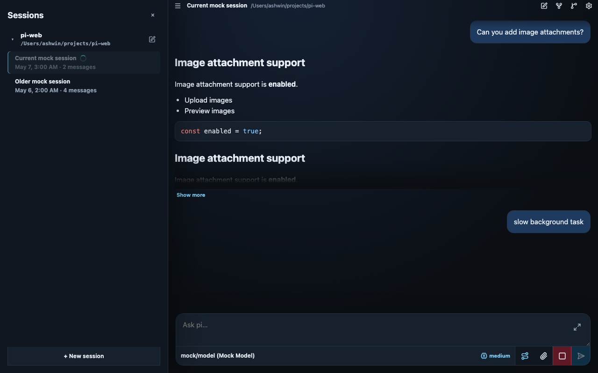
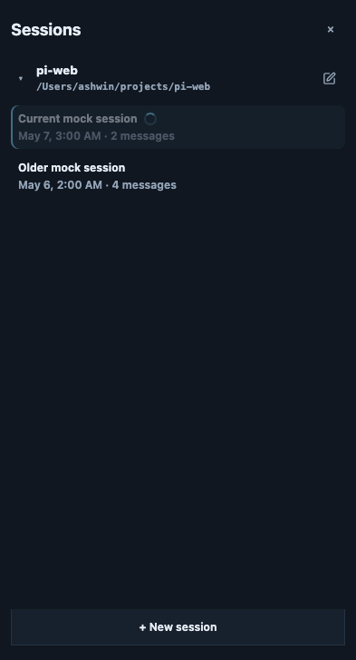
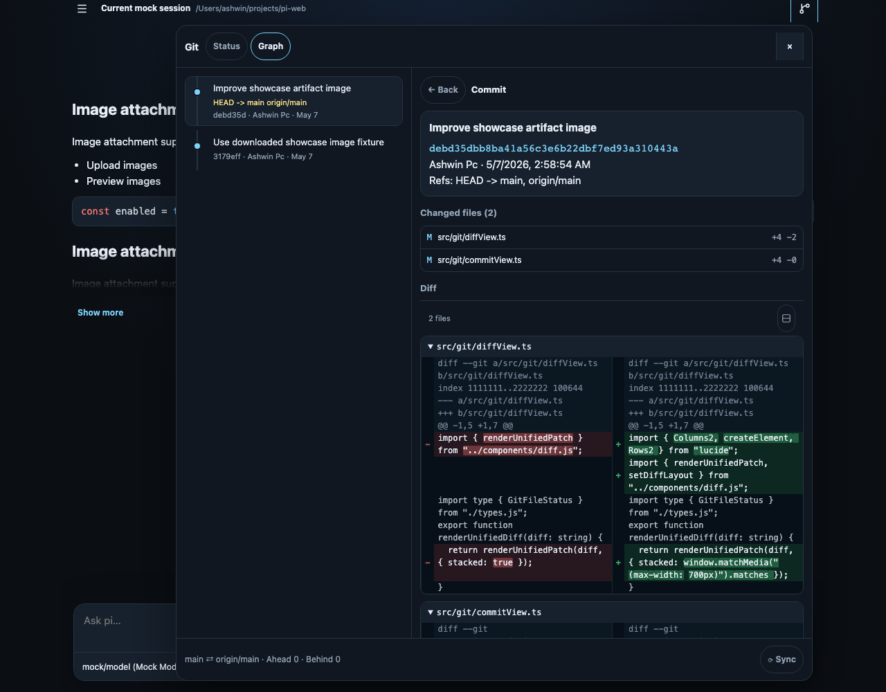
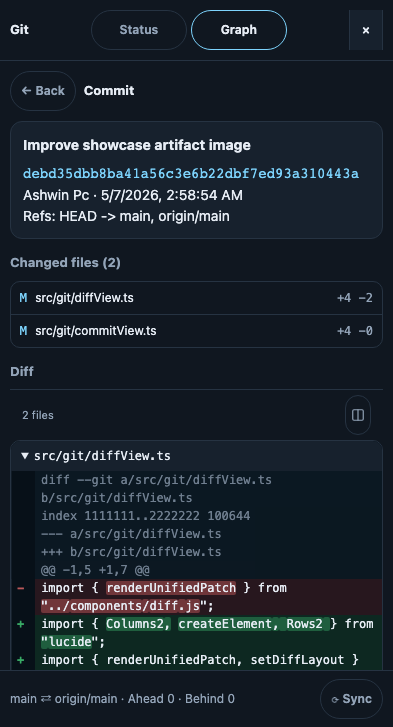
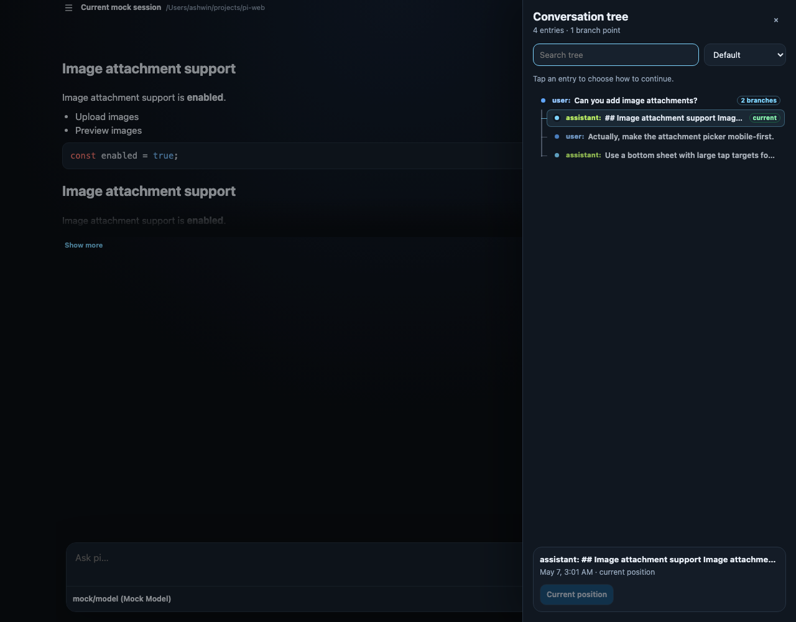
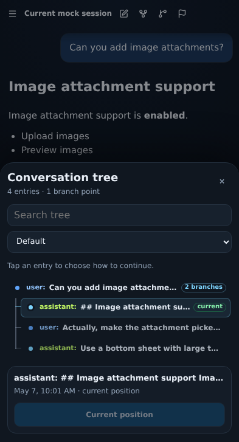

# pi-web (Claude Code fork)

> **A fork of [pi-web](https://github.com/ashwin-pc/pi-web) that also supports [Claude Code](https://docs.anthropic.com/en/docs/claude-code).**
> A per-session agent selector lets you drive both the pi agent and the local `claude` CLI from one unified web UI — the session drawer, tabs, model picker, and slash-command palette all work across both agents.

A minimal, mobile-first local/Tailscale web UI for [`@earendil-works/pi-coding-agent`](https://www.npmjs.com/package/@earendil-works/pi-coding-agent).

pi-web is designed to feel like the core pi agent in a browser: small, direct, self-aware about its environment, and focused on helping you work with code rather than becoming a heavyweight IDE. It runs locally, works comfortably from a phone over Tailscale, and gives pi the web-specific context it needs to render artifacts, images, sessions, diffs, and tool output clearly.

| Desktop | Mobile |
| --- | --- |
|  |  |

## This fork: Claude Code support

This is a fork of [`ashwin-pc/pi-web`](https://github.com/ashwin-pc/pi-web) that adds a **per-session agent selector**, so you can run **Claude Code** sessions alongside pi from the same UI:

- Pick **pi** or **claude-code** per session from the model popover (the agent is locked once a session has messages — start a new session to switch).
- Claude Code sessions drive the local `claude` CLI in streaming-JSON mode, replay existing `~/.claude/projects` transcripts, and surface CC's native + project/plugin slash commands and skills in the command palette.
- The unified session drawer tags every row with a `pi` / `cc` badge so mixed-agent lists stay scannable.
- Works with Amazon Bedrock out of the box via the usual `CLAUDE_CODE_USE_BEDROCK` / `AWS_*` environment variables.

Other additions in this fork: a repo info bar with branch + PR hyperlink, draggable session-drawer width, pin-folders, inline session rename, saved/bookmarked sessions, and an optional supervisor-managed tunnel (`PI_WEB_TUNNEL_*`).

## Why pi-web?

- Mobile-first: use pi from a phone, tablet, or desktop browser
- Minimal by design: a focused agent UI, not a full IDE replacement
- Local-first: run it on your machine and optionally expose it through Tailscale
- Self-aware: pi-web injects web UI context so sessions understand artifacts, images, restarts, and browser-specific behavior
- Code-review friendly: inspect tool output, edits, Git status, commits, and diffs
- Session-oriented: manage ongoing work with tabs, drawers, pins, buckets, filters, and conversation navigation

## What changed in 0.3.0?

0.3.0 focuses on continuity and richer session review:

- Active sessions are reflected in the URL, so refreshes, browser history, and copied links preserve the selected workspace
- Session buckets now have default colors, and inactive running tabs are dimmed for easier scanning
- Drawer filtering and flat edit diffs are more reliable
- Markdown messages can render Mermaid diagrams inline
- README showcase content and screenshots were refreshed for the current UI

See the [0.3.0 release notes](docs/releases/0.3.0.md) for the fuller changelog.

## Install

For development:

```bash
npm install
```

From npm:

```bash
npm i -g @ashwin-pc/pi-web
pi-web
```

From a GitHub release asset:

```bash
# Download pi-web-<version>.tgz from the release page, then:
npm install -g ./pi-web-*.tgz
pi-web
```

`pi-web` starts the production server on `http://127.0.0.1:8787` by default. It runs Pi in the directory where you call the command; override with `PI_WEB_CWD=/path/to/project pi-web`.

## Run locally with Vite HMR

```bash
npm run dev
```

This starts a stable TypeScript supervisor on `8787` and a restartable child server on `8788`. The public URL still serves:

- Vite frontend with HMR
- Pi API routes under `/api/*`
- Pi WebSocket at `/ws`

The supervisor also exposes:

- `POST /api/restart` - restart the child server safely
- `GET /__supervisor/status` - inspect child PID/generation

Open:

```text
http://127.0.0.1:8787
```

Edit files under `src/` and Vite will update the UI live. If the agent edits `server.ts`, call `POST /api/restart` instead of killing the public server; the supervisor stays alive and the browser reconnects.

By default, Pi operates in the directory where you start this server. To point Pi at another project:

```bash
PI_WEB_CWD=/Users/ashwin/projects/comfy-lan-webapp npm run dev
```

## Core features

### Mobile-first sessions

The session UI is built for small screens first, then scales up to desktop. Tabs, the session drawer, pinned sessions, bucket filters, and conversation navigation are designed to keep long-running pi work reachable from a phone without hiding the desktop workflow.

### Diffs and tool review

A shared diff viewer supports side-by-side or stacked layouts with intraline highlighting. It is used by both edit tool cards and Git diffs, so code review feels consistent across agent changes and repository history.

### Git status, graph, and commit diffs

The Git button in the header opens a responsive Git panel for repo status, commit history, per-file diffs, per-commit diffs, and sync with `fetch` + rebase pull.

### Self-aware pi context

`contexts/web-ui.md` is injected into agent sessions so pi understands pi-web behavior such as artifact links, image rendering, and supervised restarts. Bundled pi extensions add pi-web defaults, including automatic session naming from the first prompt.

### pi-web extensions

pi-web supports browser-specific extensions in `.pi/web/extensions` and `~/.pi/web/extensions`. These use pi's extension runtime with a typed pi-web UI API, including `ctx.ui.web.setFooter(...)` for rendering text or trusted HTML between the composer and pinned session tabs.

See [pi-web extensions](docs/pi-web-extensions.md) for locations, types, and examples, including the live git footer in [`examples/pi-web-extensions/git-footer.ts`](examples/pi-web-extensions/git-footer.ts).

## Screenshots

The README references the same deterministic Playwright visual snapshots used by `tests/e2e/visual.spec.ts`. Desktop and mobile captures are shown side by side, and when visual snapshots are intentionally updated, these images update with them.

### Diff review

| Desktop | Mobile |
| --- | --- |
|  |  |

### Session workspace

Tabs, pinned sessions, bucket colors, running indicators, and the session drawer are designed to stay usable on mobile while expanding naturally on desktop.

| Desktop | Mobile |
| --- | --- |
|  |  |

### Git panel

Desktop uses a split master/detail layout; mobile switches between status, graph, diff, and commit detail views.

| Desktop | Mobile |
| --- | --- |
|  |  |

### Conversation tree

Navigate in-file pi session branches with a compact tree drawer. The default view keeps tool noise hidden, while the full session structure remains available from the filter.

| Desktop | Mobile |
| --- | --- |
|  |  |

## Production build

```bash
npm run build
npm start
```

`npm start` serves the compiled `dist/` app and API from one process.

## Run on Tailscale with MagicDNS

Recommended: keep the Node app localhost-only and expose it with Tailscale Serve.

```bash
npm run build
PI_WEB_TOKEN="$(openssl rand -hex 32)" \
PI_WEB_CWD=/Users/ashwin/projects/comfy-lan-webapp \
HOST=127.0.0.1 \
PORT=8787 \
npm start
```

In another terminal:

```bash
tailscale serve --bg http://127.0.0.1:8787
```

Then open:

```text
https://<machine-name>.<tailnet>.ts.net
```

Click **Token** in the UI and paste the `PI_WEB_TOKEN` value.

## Direct Tailnet bind

You can also bind directly to your Tailscale IP:

```bash
PI_WEB_TOKEN="$(openssl rand -hex 32)" \
HOST="$(tailscale ip -4)" \
PORT=8787 \
npm start
```

Then open:

```text
http://<machine-name>:8787
```

## Environment variables

- `HOST` - bind host, default `127.0.0.1`
- `PORT` - bind port, default `8787`
- `PI_WEB_TOKEN` - optional bearer token for API/WebSocket access
- `PI_WEB_CWD` - project directory Pi should operate in, default current directory
- `PI_WEB_NO_SESSION=1` - use in-memory sessions only
- `PI_WEB_CHILD_PORT` - supervised child port, default `8788`
- `PI_WEB_RESTART_GRACE_MS` - delay between child stop/start, default `250`

## Development architecture

The app is TypeScript end-to-end:

- `supervisor.ts` is a small stable dev supervisor that owns the public port and restarts the app server safely
- `server.ts` is the restartable Pi API/WebSocket server, run directly with `tsx`
- `src/main.ts` bootstraps the modular Vite frontend with HMR; see [docs/frontend-architecture.md](docs/frontend-architecture.md)
- in dev, `server.ts` embeds Vite middleware while `supervisor.ts` proxies API, WebSocket, and HMR traffic
- `AGENTS.md` provides normal project-specific pi instructions when the target cwd is this repo

## Security

This app can drive Pi tools such as `bash`, `write`, and `edit`. Use Tailscale ACLs and set `PI_WEB_TOKEN`.
