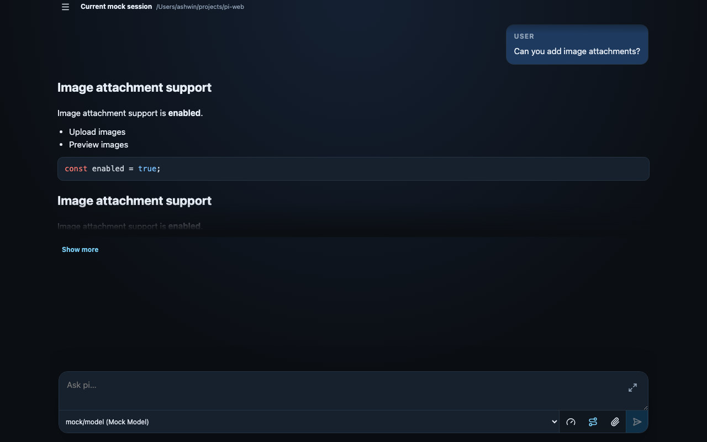
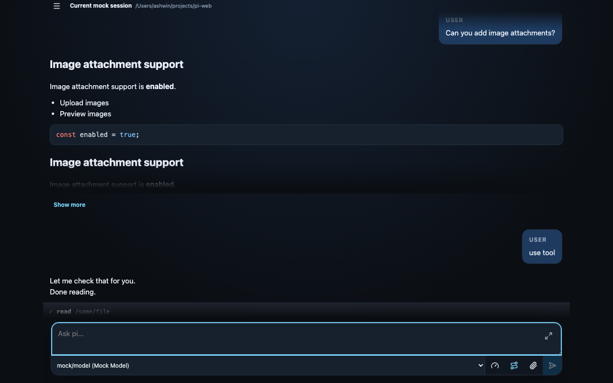

# pi-web

A small local/Tailscale web UI for [`@mariozechner/pi-coding-agent`](https://www.npmjs.com/package/@mariozechner/pi-coding-agent).



The app is TypeScript end-to-end:

- `supervisor.ts` is a small stable dev supervisor that owns the public port and restarts the app server safely
- `server.ts` is the restartable Pi API/WebSocket server, run directly with `tsx`
- `src/main.ts` is the Vite frontend with HMR
- in dev, `server.ts` embeds Vite middleware while `supervisor.ts` proxies API, WebSocket, and HMR traffic
- `contexts/web-ui.md` is always injected into agent sessions for web UI behavior like image/artifact rendering
- `AGENTS.md` provides normal project-specific pi instructions when the target cwd is this repo

## Install

```bash
npm install
```

## Run locally with Vite HMR

```bash
npm run dev
```

This starts a stable TypeScript supervisor on `8787` and a restartable child server on `8788`. The public URL still serves:

- Vite frontend with HMR
- Pi API routes under `/api/*`
- Pi WebSocket at `/ws`

The supervisor also exposes:

- `POST /api/restart` - restart the child server safely
- `GET /__supervisor/status` - inspect child PID/generation

Open:

```text
http://127.0.0.1:8787
```

Edit files under `src/` and Vite will update the UI live. If the agent edits `server.ts`, call `POST /api/restart` instead of killing the public server; the supervisor stays alive and the browser reconnects.

By default, Pi operates in the directory where you start this server. To point Pi at another project:

```bash
PI_WEB_CWD=/Users/ashwin/projects/comfy-lan-webapp npm run dev
```

## Screenshots

The README references the same deterministic Playwright visual snapshots used by `tests/e2e/visual.spec.ts`. When visual snapshots are intentionally updated, these images update with them.

<picture>
  <source media="(max-width: 700px)" srcset="tests/e2e/visual.spec.ts-snapshots/sessions-drawer-mobile.png">
  
</picture>

## Production build

```bash
npm run build
npm start
```

`npm start` serves the compiled `dist/` app and API from one process.

## Run on Tailscale with MagicDNS

Recommended: keep the Node app localhost-only and expose it with Tailscale Serve.

```bash
npm run build
PI_WEB_TOKEN="$(openssl rand -hex 32)" \
PI_WEB_CWD=/Users/ashwin/projects/comfy-lan-webapp \
HOST=127.0.0.1 \
PORT=8787 \
npm start
```

In another terminal:

```bash
tailscale serve --bg http://127.0.0.1:8787
```

Then open:

```text
https://<machine-name>.<tailnet>.ts.net
```

Click **Token** in the UI and paste the `PI_WEB_TOKEN` value.

## Direct Tailnet bind

You can also bind directly to your Tailscale IP:

```bash
PI_WEB_TOKEN="$(openssl rand -hex 32)" \
HOST="$(tailscale ip -4)" \
PORT=8787 \
npm start
```

Then open:

```text
http://<machine-name>:8787
```

## Environment variables

- `HOST` - bind host, default `127.0.0.1`
- `PORT` - bind port, default `8787`
- `PI_WEB_TOKEN` - optional bearer token for API/WebSocket access
- `PI_WEB_CWD` - project directory Pi should operate in, default current directory
- `PI_WEB_NO_SESSION=1` - use in-memory sessions only
- `PI_WEB_CHILD_PORT` - supervised child port, default `8788`
- `PI_WEB_RESTART_GRACE_MS` - delay between child stop/start, default `250`

## Security

This app can drive Pi tools such as `bash`, `write`, and `edit`. Use Tailscale ACLs and set `PI_WEB_TOKEN`.
